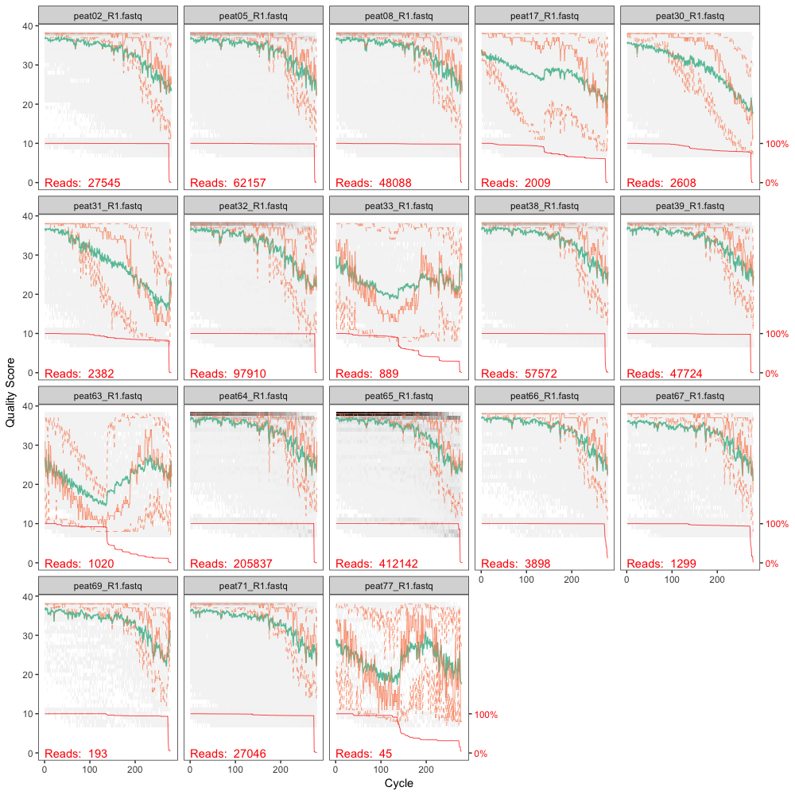
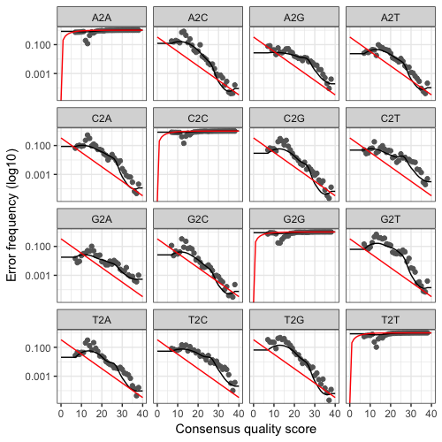

# Analysis of archaeal amoA gene amplicons

Written by alexandre.bagnoud@gmail.com and henri.siljanen@uef.fi in May 2018

This script was used for analyzing archaeal amoA amplicon sequences generated with the primers pair CamoaA-19F and TamoA-629R-2 and sequenced with Illumina MiSeq with a 2x300 bp configuration.
These data were published here:

*add here the reference of the article once published*

#### Software used:
* DADA2 v1.6.0 (https://benjjneb.github.io/dada2/index.html)
* QIIME1 v1.9.1 (http://qiime.org/)
* R v.3.4.4 and packages
* USEARCH v.8 (https://www.drive5.com/usearch/)

#### Database used:
* Alves et al., 2018, Nature Communications (Supplementary Information)

#### 1) Preparing the data

* Place all the fastq.bz2 files in one folder '0/raw_data'. Used the the reads trimmed from any non-biological sequences.
* Rename them if needed.
* Convert the fastq files into fastq (on the terminal):

```
bzip2 -d 0/raw_data*.bz2
```
#### 2) DADA2 pipeline (in R)

This part is was written based on the [DADA2 tutorial](https://benjjneb.github.io/dada2/tutorial.html)

##### 2.1) Set-up the R environment
* Load DADA2
```
library("dada2")
```
* Define the path variable for the fastq files
```
path <- "0-raw_data/"list.files(path)
##  [1] "peat02_R1.fastq" "peat02_R2.fastq" "peat05_R1.fastq" "peat05_R2.fastq" "peat08_R1.fastq" "peat08_R2.fastq" "peat17_R1.fastq"
##  [8] "peat17_R2.fastq" "peat30_R1.fastq" "peat30_R2.fastq" "peat31_R1.fastq" "peat31_R2.fastq" "peat32_R1.fastq" "peat32_R2.fastq"
## [15] "peat33_R1.fastq" "peat33_R2.fastq" "peat38_R1.fastq" "peat38_R2.fastq" "peat39_R1.fastq" "peat39_R2.fastq" "peat63_R1.fastq"
## [22] "peat63_R2.fastq" "peat64_R1.fastq" "peat64_R2.fastq" "peat65_R1.fastq" "peat65_R2.fastq" "peat66_R1.fastq" "peat66_R2.fastq"
## [29] "peat67_R1.fastq" "peat67_R2.fastq" "peat69_R1.fastq" "peat69_R2.fastq" "peat71_R1.fastq" "peat71_R2.fastq" "peat77_R1.fastq"
## [36] "peat77_R2.fastq"
```

##### 2.2) Filtering and trimming
* Extracting sample names
```
fnFs <- sort(list.files(path, pattern="_R1.fastq", full.names = TRUE))

sample.names <- sapply(strsplit(basename(fnFs), "_"), `[`, 1)
sample.names
##  [1] "peat02" "peat05" "peat08" "peat17" "peat30" "peat31" "peat32" "peat33" "peat38" "peat39" "peat63" "peat64" "peat65" "peat66" "peat67"
## [16] "peat69" "peat71" "peat77"
```
* Read quality vizualisation of the R1 samples
```
plotQualityProfile(fnFs[1:18])
```

* Read filtering and trimming
```
filt_path <- file.path("1-filtered_reads")
filtFs <- file.path(filt_path, paste0(sample.names, "_F_filt.fastq.gz"))

out <- filterAndTrim(fnFs, filtFs,  truncLen=c(200),
                     maxN=0, maxEE=c(2), truncQ=2, rm.phix=TRUE,
                     compress=TRUE, multithread=TRUE)

out
##                 reads.in reads.out
## peat02_R1.fastq    27545     24097
## peat05_R1.fastq    62157     56235
## peat08_R1.fastq    48088     42919
## peat17_R1.fastq     2009       945
## peat30_R1.fastq     2608      1493
## peat31_R1.fastq     2382      1185
## peat32_R1.fastq    97910     83619
## peat33_R1.fastq      889       220
## peat38_R1.fastq    57572     52295
## peat39_R1.fastq    47724     42763
## peat63_R1.fastq     1020       124
## peat64_R1.fastq   205837    186203
## peat65_R1.fastq   412142    368307
## peat66_R1.fastq     3898      3591
## peat67_R1.fastq     1299      1120
## peat69_R1.fastq      193       164
## peat71_R1.fastq    27046     23293
## peat77_R1.fastq       45        11
```

##### 2.3) Learn the error rates
```
errF <- learnErrors(filtFs, multithread=TRUE)
plotErrors(errF, nominalQ=TRUE)
```


##### 2.4) Dereplication
```
derepFs <- derepFastq(filtFs, verbose=TRUE)
```
* Name the derep-class objects by the sample names
```
names(derepFs) <- sample.names
```
##### 2.5) Sample inferrence
```
dadaFs <- dada(derepFs, err=errF, multithread=TRUE)
```

##### 2.6) Construct sequence table
```
seqtab <- makeSequenceTable(dadaFs, derepFs)
dim(seqtab)
## [1]  18 319
```
* Inspect distribution of sequence lengths
```
table(nchar(getSequences(seqtab)))
## 200 
## 319
```

##### 2.6) *denovo* chimera removal
```
seqtab.nochim <- removeBimeraDenovo(seqtab, method="consensus", multithread=TRUE, verbose=TRUE)
## Identified 65 bimeras out of 319 input sequences.

dim(seqtab.nochim)
## 18 254

sum(seqtab.nochim)/sum(seqtab) # What is the fraction of reads that were not discarded?
## [1] 0.9871345
```
##### 2.7) Track the reads through the DADA2 pipeline
```
getN <- function(x) sum(getUniques(x))
track <- cbind(out, sapply(dadaFs, getN), rowSums(seqtab), rowSums(seqtab.nochim))

colnames(track) <- c("input", "filtered", "denoised", "tabled", "nonchim")
rownames(track) <- sample.names
track
##         input filtered denoised tabled nonchim
## peat02  27545    24097    24077  24077   23428
## peat05  62157    56235    56091  56091   55770
## peat08  48088    42919    42897  42897   42897
## peat17   2009      945      914    914     914
## peat30   2608     1493     1484   1484    1484
## peat31   2382     1185     1165   1165    1165
## peat32  97910    83619    83246  83246   82925
## peat33    889      220      212    212     212
## peat38  57572    52295    52261  52261   52154
## peat39  47724    42763    42717  42717   42251
## peat63   1020      124      111    111     111
## peat64 205837   186203   185917 185917  185168
## peat65 412142   368307   368100 368100  362337
## peat66   3898     3591     3586   3586    3580
## peat67   1299     1120     1106   1106    1106
## peat69    193      164      163    163     163
## peat71  27046    23293    23201  23201   20168
## peat77     45       11        9      9       9

write.table(track, "1-track.txt", quote = FALSE, sep = "\t", col.names = NA)
```

##### 2.8) Export data
* fasta of uniques non-chimeric reads
```
uniquesToFasta(getUniques(seqtab.nochim), "2-uniques_nochim.fasta")
```
* ASV table
```
write.table(t(seqtab.nochim), "3-asv_table.txt", sep="\t", row.names=TRUE, col.names=NA, quote=FALSE)
```

#### 3) Further chimera filtration and annotations of ASVs sequences (in the terminal)

* Set-up path to databases files
```
db_seq="databases/d_AamoA.db_nr_aln.fasta"
qiime_tax="databases/e_AamoA.db_nr_aln_taxonomy_qiime.txt"
mothur_tax="databases/f_AamoA.db_nr_aln_taxonomy_mothur.txt"
chimera_db="databases/j_AamoA_chimera.ref.db_aln.trim.fasta"
```

### 3.1) Discard all sequences that share less than 55% identity with any reference sequences
```
usearch8 -usearch_global 2-uniques_nochim.fasta -db $db_seq -id 0.55 -strand plus \
-uc 4a-uclust_report.txt -matched 4b-uniques_nochim_match.fasta -notmatched 4c-uniques_nochim_nomatch.fasta
## 100.0% Searching, 63.4% matched
```

### 3.2) UCHIME chimera filtration (using parameters defined by [Alves et al., 2018](https://www.nature.com/articles/s41467-018-03861-1))

For this step, USEARCH v.8 must be used. The latter versions use UCHIME2 instead of UCHIME, for which it is not possible anymore to specifiy the ```-mindiv``` and ```-minh```.
```
usearch8 -uchime_ref  4b-uniques_nochim_match.fasta -db $chimera_db \
-nonchimeras 5a-uniques_nochim_match_uchimed.fasta -strand plus -mindiv 1.7 -minh 0.1 -uchimeout 5b-uchime_report.txt
## 100.0% Found 2/161 chimeras (1.2%), 59 not classified (36.6%)
```

### 3.3) Annotation of the OTUs (with UCLUST implemented in QIIME1)

```
source activate qiime1
assign_taxonomy.py -i 5a-uniques_nochim_match_uchimed.fasta -t $qiime_tax -r $db_seq --similarity 0.8 \
-o 6-uniques_nochim_match_uchimed_uclust_annotation/
source deactivate qiime1
```
* What is the number of unique annotations?
```
less 6-uniques_nochim_match_uchimed_uclust_annotation/5a-uniques_nochim_match_uchimed_tax_assignments.txt | cut -f2 | sort -u | wc -l
##  9
```

* How many unassigned ASVs there is?
```
grep -c Unassigned 6-uniques_nochim_match_uchimed_uclust_annotation/5a-uniques_nochim_match_uchimed_tax_assignments.txt
## 0
```

# Import annotation file
annot <- read.table("/Users/siljanen/Documents/AA_MiSeq_data_LCG/LGC_G20002861_part1/PrimerClipped/Henri_AOA_amoA/Peat_soil_DNA/Raw_R1R2/2-dada2/
                    6-uniques_nochim_match_uchimed_uclust_annotation/5a-uniques_nochim_match_uchimed_tax_assignments_NVcleaned.txt",
                    header = FALSE)
annot$V4 <- NULL
names(annot) <- c("asv", "annotation", "confidence")

# Retain the clade annotation in 1 column
library(stringr)
annot_l2 <- str_split_fixed(annot$annotation, ";", 11)[,2]
annot_l1 <- str_split_fixed(annot$annotation, ";", 11)[,1]
annot_l2[annot_l2 == ""] <- annot_l1[annot_l2 == ""]

annot$annotation_l2 <- annot_l2

head(annot)
# Import fasta file (uniques and chemira-free reads) (here we have dada2 produced non-chemric uniques which have been uchimed with usearch8)
library("Biostrings")
citation("Biostrings")

fasta_file <- readDNAStringSet("/Users/siljanen/Documents/AA_MiSeq_data_LCG/LGC_G20002861_part1/PrimerClipped/Henri_AOA_amoA/Peat_soil_DNA/Raw_R1R2/2-dada2/9-clean_asvs_dada2.fasta")
head(fasta_file)
asv = names(fasta_file)
seq = paste(fasta_file)
fasta_df <- data.frame(asv, seq)

head(fasta_file)
head(asv)
head(seq)
head(fasta_df)

# Import ASV table (dada2 generated asv-table)
asv_tab <- read.table("/Users/siljanen/Documents/AA_MiSeq_data_LCG/LGC_G20002861_part1/PrimerClipped/Henri_AOA_amoA/Peat_soil_DNA/Raw_R1R2/2-dada2/3-asv_table.txt", header = T, row.names = NULL)
names(asv_tab)[1] <- "seq"

colnames(asv_tab)
colnames(afa_aggr_rel)

# Merge all three data frames
af <- merge(fasta_df, annot)
afa_abs <- merge(af, asv_tab)

# Compute relative abundances of ASVs
asv_counts <- colSums(afa_abs[,6:ncol(afa_abs)])
afa_rel <- afa_abs
afa_rel[,6:ncol(afa_abs)] <- sweep(afa_abs[,6:ncol(afa_abs)], 2, asv_counts, `/`)
afa_rel[is.na(afa_rel)] <- 0


# Aggregate all identical phylogenetic annotations (full annotations)
afa_aggr <- aggregate(afa_abs[,6:ncol(afa_abs)], by=list(annotation=afa_abs$annotation), FUN=sum)
afa_aggr_rel <- aggregate(afa_rel[,6:ncol(afa_rel)], by=list(annotation=afa_rel$annotation), FUN=sum)

dim(afa_aggr_rel)
# 7  13
# With Taz:  8 19


# Aggregate all identical phylogenetic annotations (level-2 annotations)
afa_aggr_l2 <- aggregate(afa_abs[,6:ncol(afa_abs)], by=list(annotation=afa_abs$annotation_l2), FUN=sum)
afa_aggr_l2_rel <- aggregate(afa_rel[,6:ncol(afa_rel)], by=list(annotation=afa_rel$annotation_l2), FUN=sum)

head(afa_aggr_l2)
head(afa_aggr_l2_rel)

# export the annotation asv tables
"""
mkdir 3-annotation
"""

write.table(afa_abs, "2-dada2/3-annotation/2a-asv_tab_tax.txt", sep = "\t", quote = FALSE, row.names = FALSE)
write.table(afa_rel, "2-dada2/3-annotation/2b-asv_tab_rel_tax.txt", sep = "\t", quote = FALSE, row.names = FALSE)
write.table(afa_aggr, "2-dada2/3-annotation/3a-asv_tab_tax_merged.txt", sep="\t", quote = FALSE, row.names = FALSE)
write.table(afa_aggr_rel, "2-dada2/3-annotation/3b-asv_tab_rel_tax_merged.txt", sep="\t", quote = FALSE, row.names = FALSE)
write.table(afa_aggr_l2, "2-dada2/3-annotation/4a-asv_tab_tax_merged_l2.txt", sep="\t", quote = FALSE, row.names = FALSE)
write.table(afa_aggr_l2_rel, "2-dada2/3-annotation/4b-asv_tab_rel_tax_merged_l2.txt", sep="\t", quote = FALSE, row.names = FALSE)


## 12-top OTUS BARPLOTS for unaggregated data:


## NMDS for simplified asv list
library(vegan)
asv_table_simple <- read.csv("2-dada2/3-annotation/2b-asv_tab_rel_tax_manual_heatmap_simple3pros_for_NMDS.csv",header=T,sep=";",row.names=1)
asv_table_simple_bare <- read.csv("2-dada2/3-annotation/2b-asv_tab_rel_tax_manual_heatmap_simple3pros_onlyBARE_for_NMDS.csv",header=T,sep=";",row.names=1)
asv_table_NMDS <- read.table("2b-asv_tab_rel_tax_forNMDS_noseq copy.txt",header=T,sep="\t",row.names=1)

t_asv_table_simple_bare <- t(asv_table_simple_bare)
t_asv_table_NMDS <- t(asv_table_NMDS)

asv_table_NMDS_withTaz <- read.table("2b-asv_tab_rel_tax_NMDS_withTaz.txt",header=T,sep="\t",row.names=1)

t_asv_table_NMDS_withTaz <- t(asv_table_NMDS_withTaz)


head(t_asv_table_NMDS_withTaz)

test_NMDS <- metaMDS(t_asv_table_NMDS_withTaz)
stressplot(test_NMDS)
ordiplot(test_NMDS,type="n")
orditorp(test_NMDS,display="species",cex=0.3,col="red",air=0.01)
orditorp(test_NMDS,display="sites",cex=0.3,air=0.01)


replicates_list_NEW <- c("peat_002", "peat_005", "peat_008", "peat_017",  
                          "peat_030", "peat_031", "peat_032", "peat_033",
                         "peat_038", "peat_039", "peat_064", 
                         "peat_065", "peat_066", "peat_063", "peat_067", "peat_069", "peat_071", "peat_077")


#surface only:
replicates_groups_NEW <- c("Kev_BS", "Kev_BS", "Kev_BS", "Kev_VS",
                           "Taz_PP_VS", "Taz_PP_VS", "Taz_PP_BS", "Taz_PP_BS", "Taz_PB_BS", "Taz_PB_BS",
                           "Sei_BS", "Sei_BS", "Sei_BS", "Sei_VS",
                           "Tay_BS", "Tay_BS", "Tay_BS", 
                           "Tay_VS")


ps<-c(rep(0,3), rep(0,1), rep(1,2), rep(1,2), rep(2,2), rep(5,3), rep(5,1), rep(6,3), rep(6,1))
cl<-c(rep("black",3), rep("white",1), rep("white",2), rep("black",2), rep("black",2), rep("black",3), rep("white",1), rep("black",3), rep("white",1))

ps_b<-c(rep(21,3),  rep(24,3), rep(25,3))
cl_b<-c(rep(3,3), rep(2,3), rep(6,3))

ordiplot(test_NMDS,type="n")

?pch
# Make points:
points(test_NMDS, pch=ps, col="black", bg=cl, cex=1)
points(test_NMDS_b, pch=ps_b, col="black", bg=cl_b, cex=1.2)
orditorp(test_NMDS_b,display="species",cex=0.5,col="red",air=0.01)

legend(x="topleft", legend=c("Kevo", "Tazorvsky PP","Tazorvsky PB" "Seida", "Taymyr"),
       pch=c(0,1,2, 5, 6), col="black", bty="n", title="Sites", cex=0.6)

legend(x="topright", legend=c("Kevo bare", "Kevo veg","Seida veg", "Seida bare", "Taymyr bare",  "Taymyr veg"),
       pch=c(21,22,23,24,25,3), col="black", pt.bg=c(3,4,5,2,6,7), bty="n", title="Sites", cex=0.6)

#########################################################################################
##  Bubbleplot script modification:

# written by alexandre.bagnoud@gmail.com, April 2018

setwd("/Users/siljanen/Documents/AA_MiSeq_data_LCG/LGC_G20002861_part1/PrimerClipped/Henri_AOA_amoA/Peat_soil_DNA/Raw_R1R2/2-dada2")

library(stringr)
citation("stringr")


# files to import

annot_file <- "/Users/siljanen/Documents/AA_MiSeq_data_LCG/LGC_G20002861_part1/PrimerClipped/Henri_AOA_amoA/Peat_soil_DNA/Raw_R1R2/2-dada2/6-uniques_nochim_match_uchimed_uclust_annotation/5a-uniques_nochim_match_uchimed_tax_assignments_NVcleaned_DADA+USEARCH.txt"

annot_type <- "uclust" # either "uclust" or "mothur"
otu_tab_file <- "/Users/siljanen/Documents/AA_MiSeq_data_LCG/LGC_G20002861_part1/PrimerClipped/Henri_AOA_amoA/Peat_soil_DNA/Raw_R1R2/2-dada2/3-annotation/2a-asv_tab_tax_mod_for_bubble.txt"

## Other variables to define
output_folder <- "10_plots_and_tables"
plot_title <- "dada2+usearch_R1_pipeline"

# Number of taxons to display in the full-length taxonomy bar plots (the low abundance one will be pool together in a bin nameed "Other")
tax_number <- 6

#Surface only
replicates_list <- c("peat_2", "peat_5", "peat_8", "peat_17",  "peat_64", 
                    "peat_65", "peat_66", "peat_63", "peat_67", "peat_69", "peat_71", "peat_77")

#surface only:
replicates_groups <- c("Kev_BS", "Kev_BS", "Kev_BS", "Kev_VS",
                        "Sei_BS", "Sei_BS", "Sei_BS", "Sei_VS",
                       "Tay_BS", "Tay_BS", "Tay_BS", 
                       "Tay_VS")

dir.create(output_folder)

# Import annotation file
if (annot_type == "uclust") {
  annot <- read.table(annot_file)
  annot$V3 <- NULL
  annot$V4 <- NULL
  names(annot) <- c("otu", "annotation")
  annot$annot_l2 <- str_split_fixed(annot$annotation, ";", 11)[,2]
  annot$annotation_short <- gsub("^.*;", "", annot$annotation)
  annot$otu <- sub(";.*;", "", annot$otu)
} else if (annot_type == "mothur") {
  annot_temp <- read.table(annot_file)
  otu.vec <- gsub(";.*;", "", annot_temp$V1)
  annot.vec <- gsub("\\([0-9]*\\)", "", sub("_unclassified.*$","" , annot_temp$V2))
  annot_l2.vec <- str_split_fixed(annot.vec, ";", 11)[,2]
  annot_short.vec <- sub("^.*;", "", annot.vec)
  annot <- data.frame(otu = otu.vec, annotation = annot.vec, annot_l2=annot_l2.vec, annot_short=annot_short.vec)
}


# Import ASV table
otu_tab <- read.table(otu_tab_file, header = T, row.names = NULL, sep = "\t", comment.char = "@")
names(otu_tab)[1] <- "otu"

# Compute relative abundances of ASVs
otu_counts <- colSums(otu_tab[,-1])
otu_tab_rel <- otu_tab
otu_tab_rel[,-1] <- sweep(otu_tab[,-1], 2, otu_counts, `/`)
otu_tab_rel[is.na(otu_tab_rel)] <- 0

# Merge annotation and otu table
otutab_tax_abs <- merge(annot, otu_tab)
otutab_tax_rel <- merge(annot, otu_tab_rel)

# Aggregate all identical phylogenetic annotations (full annotations)
otutab_tax_aggr <- aggregate(otutab_tax_abs[,5:ncol(otutab_tax_abs)], by=list(annotation=otutab_tax_abs$annotation), FUN=sum)
otutab_tax_aggr_rel <- aggregate(otutab_tax_rel[,5:ncol(otutab_tax_rel)], by=list(annotation=otutab_tax_rel$annotation), FUN=sum)

# Aggregate all identical phylogenetic annotations (level-2 annotations)
otutab_tax_aggr_l2 <- aggregate(otutab_tax_abs[,5:ncol(otutab_tax_abs)], by=list(annotation=otutab_tax_abs$annot_l2), FUN=sum)
otutab_tax_aggr_l2_rel <- aggregate(otutab_tax_rel[,5:ncol(otutab_tax_rel)], by=list(annotation=otutab_tax_rel$annot_l2), FUN=sum)

paste0(output_folder, "/", "1a-otu_tab_tax.txt")

# export the annotation asv tables
write.table(otutab_tax_abs, paste0(output_folder, "/", "1a-otu_tab_tax.txt"), sep = "\t", quote = FALSE, row.names = FALSE)
write.table(otutab_tax_rel, paste0(output_folder, "/", "1b-otu_tab_rel_tax.txt"), sep = "\t", quote = FALSE, row.names = FALSE)
write.table(otutab_tax_aggr, paste0(output_folder, "/", "2a-otu_tab_tax_merged.txt"), sep="\t", quote = FALSE, row.names = FALSE)
write.table(otutab_tax_aggr_rel, paste0(output_folder, "/", "2b-otu_tab_rel_tax_merged.txt"), sep="\t", quote = FALSE, row.names = FALSE)
write.table(otutab_tax_aggr_l2, paste0(output_folder, "/", "3a-otu_tab_tax_merged_l2.txt"), sep="\t", quote = FALSE, row.names = FALSE)
write.table(otutab_tax_aggr_l2_rel, paste0(output_folder, "/", "3b-otu_tab_rel_tax_merged_l2.txt"), sep="\t", quote = FALSE, row.names = FALSE)


############################################################
  
library("RColorBrewer")
library("reshape2")
library("ggplot2")

citation("RColorBrewer")
citation("reshape2")
citation("ggplot2")
citation("vegan")

## This was made for previsou version of the data set without Taz:
dat_3pros_lim <- "/Users/siljanen/Documents/AA_MiSeq_data_LCG/LGC_G20002861_part1/PrimerClipped/Henri_AOA_amoA/Peat_soil_DNA/Raw_R1R2/2-dada2/3-annotation/data_3pros_lim_mod_molten.txt"

setwd("/Users/siljanen/Documents/AA_MiSeq_data_LCG/LGC_G20002861_part1/PrimerClipped/Henri_AOA_amoA/Peat_soil_DNA/Raw_R1R2/2-dada2/3-annotation/")

otu_3pros_lim_molten <- read.table("data_3pros_lim_mod_molten.txt" , header = T, row.names = NULL, sep = "\t", comment.char = "@")
otu_3pros_lim_molten$X <- NULL

otutab_Top40asvs_molten <- read.table("Final_otutab_Top40asvs.txt" , header = T, row.names = NULL, sep = "\t", comment.char = "@")

## This was made for previous version of the data set without Taz:

setwd("/Users/siljanen/Documents/AA_MiSeq_data_LCG/LGC_G20002861_part1/PrimerClipped/Henri_AOA_amoA/Peat_soil_DNA/Raw_R1R2/2-dada2/3-annotation/")

#Taxonomy merged to OTU-level 
# Files re-organized in Excel: mean of replicates calculated and dataframe molten manually,
##  In Text-editor Varible names are shorten: e.g. NS;NS-Gamma;NS-Gamma-2;NS-Gamma-2,3;NS-Gamma-2,3,2;NS-Gamma-2,3,2_OTU5 
####  to NS-Gamma-2,3,2_OTU5

otutab_with_Taz_molten <- read.table("3b-asv_tab_rel_tax_merged_molten.txt" , header = T, row.names = NULL, sep = "\t", comment.char = "@")
otutab_Top40asvs_with_Taz_molten <- read.table("With_Taz_otutab_top40_molten_final.txt" , header = T, row.names = NULL, sep = "\t", comment.char = "@")

otutab_Top40asvs_with_Taz_molten_B_V_order <- read.table("With_Taz_otutab_top40_molten_final_Bare_Veg_order.txt" , header = T, row.names = NULL, sep = "\t", comment.char = "@")

otutab_g_merged_with_Taz_molten <- read.table("4b-asv_rel_g-merged_molten.txt" , header = T, row.names = NULL, sep = "\t", comment.char = "@")

otutab_g_merged_with_Taz_molten_B_V_order <- read.table("4b-asv_rel_g-merged_molten_Bare_Veg_order.txt" , header = T, row.names = NULL, sep = "\t", comment.char = "@")

plot_title <- "DADA2+usearch pipeline"
bubble_plot_file_name <- "5-barplots/3-bubbleplot_dada2nochim.fasta"


bubble_plot_Top40asvs_with_Taz_molten_B_V_order <- ggplot(otutab_Top40asvs_with_Taz_molten_B_V_order,aes(sample,variable)) +
  #geom_point(aes(size=value+sd),shape=16, color = "red") +
  geom_point(aes(size=value, fill=clade),shape=21,color="black") +
  #geom_point(aes(size=value, color=otu_molten2$clade)) +
  theme(panel.grid.major=element_line(linetype=1,color="grey"),
        axis.text.x=element_text(angle=90,hjust=1,vjust=0),
        panel.background = element_blank()) +
  ylab("Thaumarchaeota OTUs") +
  xlab("Samples") +
  scale_fill_brewer(palette="Set1", name="Taxonomic\nclade") +
  scale_size(name = "Relative\nabundance") +
  ggtitle(plot_title)

bubble_plot_Top40asvs_with_Taz_molten_B_V_order

svg(paste0(output_folder, "/7-bubbleplot.svg"), width = 6, height = 6)
bubble_plot
dev.off()

############################################################

# export the annotation asv tables
write.table(otutab_tax_aggr, paste0(output_folder, "/", "2a-otu_tab_tax_merged.txt"), sep="\t", quote = FALSE, row.names = FALSE)
write.table(otutab_tax_aggr_rel, paste0(output_folder, "/", "2b-otu_tab_rel_tax_merged.txt"), sep="\t", quote = FALSE, row.names = FALSE)

## In 2a-asv_tab_tax_30top.xlsx file relative abundance was recalculated and TOP40 asvs were selected.
##  From these new otutab_tax_aggr_rel object was created to make Bubbleplot. 


dir()
otutab_tax_aggr_rel <- read.table("2a-asv_tab_tax_30top.txt" , header = T, row.names = NULL, sep = "\t", comment.char = "@")

#Surface only
replicates_list <- c("Peat_2", "Peat_5", "Peat_8", "Peat_17", "Peat_64", 
                     "Peat_65", "Peat_66", "Peat_63", "Peat_67", "Peat_69", "Peat_71", "Peat_77")

#surface only:
replicates_groups <- c("Kev_BS", "Kev_BS", "Kev_BS", "Kev_VS",
                       "Sei_BS", "Sei_BS", "Sei_BS", "Sei_VS",
                       "Tay_BS", "Tay_BS", "Tay_BS", 
                       "Tay_VS")


# Transpose the ASV table
n <- otutab_tax_aggr_rel$annotation2
t.otu_aggr_rel <- as.data.frame(t(otutab_tax_aggr_rel[,c(-1,-nrow(otutab_tax_aggr_rel))]))
colnames(t.otu_aggr_rel) <- n
t.otu_aggr_rel$sample <- rownames(t.otu_aggr_rel)
rownames(t.otu_aggr_rel) <- NULL
t.otu_aggr_rel <- t.otu_aggr_rel[1:ncol(otu_tab)-1,]

# Calculate average of each replicate
t.otu_aggr_rel$replicate <- rep(NA, nrow(t.otu_aggr_rel))
for (line in 1:(nrow(t.otu_aggr_rel)-1)){
  t.otu_aggr_rel$replicate[line] <- replicates_groups[t.otu_aggr_rel$sample[line] == replicates_list]
}

t.otu_replicates <- aggregate(t.otu_aggr_rel[,1:(ncol(t.otu_aggr_rel)-2)],
                              by = list(t.otu_aggr_rel$replicate),
                              FUN = "mean")

names(t.otu_replicates)[1] <- "sample"


# Melt the dataframe
otu_replicates_molten <- melt(t.otu_replicates, id.vars = "sample")
otu_replicates_molten$clade <- str_split_fixed(otu_replicates_molten$variable, ";", 11)[,2]
otu_replicates_molten$clade[otu_replicates_molten$clade == ""] <- "Unassigned"
otu_replicates_molten$variable <- gsub("^.*;", "", otu_replicates_molten$variable)
otu_replicates_molten$sample <- factor(otu_replicates_molten$sample, levels = unique(replicates_groups))
otu_replicates_molten$row.id <- paste0(otu_replicates_molten$sample, otu_replicates_molten$variable)

# Calculate the standard deviation for each replicate
t.otu_sd <- aggregate(t.otu_aggr_rel[,1:(ncol(t.otu_aggr_rel)-2)],
                      by = list(t.otu_aggr_rel$replicate),
                      FUN = "sd")

names(t.otu_sd)[1] <- "sample"

# Melt the sd dataframe
otu_sd_molten <- melt(t.otu_sd, id.vars = "sample")
otu_sd_molten$variable <- gsub("^.*;", "", otu_sd_molten$variable)
names(otu_sd_molten)[3] <- "sd"
otu_sd_molten$row.id <- paste0(otu_sd_molten$sample, otu_sd_molten$variable)
otu_sd_molten$sample <- NULL
otu_sd_molten$variable <- NULL

# Merge both dataframe (mean and sd)
otu_molten <- merge(otu_replicates_molten, otu_sd_molten)

# Reorder the taxonomic annotation for the plot
tax_levels <- sort(unique(list(sub("^.*;", "", otutab_tax_aggr_rel$annotation))[[1]]), decreasing = TRUE)
otu_molten$variable <- factor(otu_molten$variable, levels = tax_levels)
otu_molten$variable <- factor(otu_molten$variable)

# Remove null values
otu_molten2 <- otu_molten[otu_molten$value > 0,]

View(otu_molten2)

bubble_plot <- ggplot(otu_molten2,aes(sample,variable)) +
  #geom_point(aes(size=value+sd),shape=16, color = "red") +
  geom_point(aes(size=value, fill=otu_molten2$clade),shape=21,color="black") +
  #geom_point(aes(size=value, color=otu_molten2$clade)) +
  theme(panel.grid.major=element_line(linetype=1,color="grey"),
        axis.text.x=element_text(angle=90,hjust=1,vjust=0),
        panel.background = element_blank()) +
  ylab("Thaumarchaeota OTUs") +
  xlab("Samples") +
  scale_fill_brewer(palette="Set1", name="Taxonomic\nclade") +
  scale_size(name = "Relative\nabundance") +
  ggtitle(plot_title)

bubble_plot

svg(paste0(output_folder, "/7-bubbleplot.svg"), width = 6, height = 6)
bubble_plot
dev.off()

