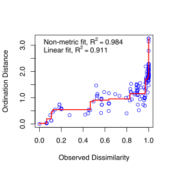

# Analysis of archaeal amoA gene amplicons

Written by alexandre.bagnoud@gmail.com and henri.siljanen@uef.fi in May 2018

This script was used for analyzing archaeal amoA amplicon sequences generated with the primers pair CamoaA-19F and TamoA-629R-2 and sequenced with Illumina MiSeq with a 2x300 bp configuration.
These data were published here:

*Henri M.P. Siljanena, Ricardo J.E. Alves, Jussi G. Ronkainen, Richard E. Lamprecht, Hem R. Bhattarai, Alexandre Bagnoud, Maija E. Marushchak, Pertti J. Martikainen, Christa Schleper & Christina Biasi (2019)*. **Archaeal nitrification is a key driver of high nitrous oxide emissions from arctic peatlands.** Soil Biology and Biochemistry.

#### Main steps

##### [Step1: Preparing the data](#1-preparing-the-data)
Here we simply put all fastq files in the same folder, rename them and decompress them.
##### [Step2: DADA2 pipeline](#2-dada2-pipeline-in-r)
Here we ran DADA2 according to the official [tutorial](https://benjjneb.github.io/dada2/tutorial.html) (which corresponds to version 1.6).
##### [Step3: Further chimera filtration and annotations of ASVs sequences](#3-further-chimera-filtration-and-annotations-of-asvs-sequences-in-the-terminal)
Based on the archaeal *amoA* phylogeny of [Alves *et al*. (2018)](https://www.nature.com/articles/s41467-018-03861-1), we excluded additional chimeras with a reference-based method and we annotated ASVs.
##### [Step4: What are the abundances of the different AOA clades?](#4-what-are-the-abundances-of-the-different-aoa-clades-in-r)
Here we calculated based on qPCR data the absolute abundances of AOA clades accross the different samples.
##### [Step5: Bubble plots](#5-bubble-plots)
We produced bubble plots in R to illustrate the AOA communities structures.
##### [Step6: NMDS analysis](#6-nmds-analysis)
Finally, we performed a NMDS analysis to understand how AOA communities are structured.

#### Selected outputs
* all the plots can be found [here](plots/)
* all the other output files (except the filtered reads, too big) can be found [here](/output_files)

#### Software used:
* DADA2 v1.6.0 (https://benjjneb.github.io/dada2/index.html)
* QIIME1 v1.9.1 (http://qiime.org/)
* R v.3.4.4 and packages
* USEARCH v.8 (https://www.drive5.com/usearch/)

#### Database used:
* [Alves et al., 2018, Nature Communications](https://www.nature.com/articles/s41467-018-03861-1)

#### 1) Preparing the data

* Place all the fastq.bz2 files in one folder '0/raw_data'. Used the the reads trimmed from any non-biological sequences.
* Rename them if needed.
* Uncompress bz2 fastq files (on the terminal):

```bash
bzip2 -d 0/raw_data*.bz2
```
#### 2) DADA2 pipeline (in R)

This part is was written based on the [DADA2 tutorial](https://benjjneb.github.io/dada2/tutorial.html)

##### 2.1) Set-up the R environment
* Load DADA2
```r
library("dada2")
```
* Define the path variable for the fastq files
```r
path <- "0-raw_data/"list.files(path)
##  [1] "peat02_R1.fastq" "peat02_R2.fastq" "peat05_R1.fastq" "peat05_R2.fastq" "peat08_R1.fastq" "peat08_R2.fastq" "peat17_R1.fastq"
##  [8] "peat17_R2.fastq" "peat30_R1.fastq" "peat30_R2.fastq" "peat31_R1.fastq" "peat31_R2.fastq" "peat32_R1.fastq" "peat32_R2.fastq"
## [15] "peat33_R1.fastq" "peat33_R2.fastq" "peat38_R1.fastq" "peat38_R2.fastq" "peat39_R1.fastq" "peat39_R2.fastq" "peat63_R1.fastq"
## [22] "peat63_R2.fastq" "peat64_R1.fastq" "peat64_R2.fastq" "peat65_R1.fastq" "peat65_R2.fastq" "peat66_R1.fastq" "peat66_R2.fastq"
## [29] "peat67_R1.fastq" "peat67_R2.fastq" "peat69_R1.fastq" "peat69_R2.fastq" "peat71_R1.fastq" "peat71_R2.fastq" "peat77_R1.fastq"
## [36] "peat77_R2.fastq"
```

##### 2.2) Filtering and trimming
* Extracting sample names
```r
fnFs <- sort(list.files(path, pattern="_R1.fastq", full.names = TRUE))

sample.names <- sapply(strsplit(basename(fnFs), "_"), `[`, 1)
sample.names
##  [1] "peat02" "peat05" "peat08" "peat17" "peat30" "peat31" "peat32" "peat33" "peat38" "peat39" "peat63" "peat64" "peat65" "peat66" "peat67"
## [16] "peat69" "peat71" "peat77"
```
* Read quality vizualisation of the R1 samples
```r
plotQualityProfile(fnFs[1:18])
```

* Read filtering and trimming
```r
filt_path <- file.path("1-filtered_reads")
filtFs <- file.path(filt_path, paste0(sample.names, "_F_filt.fastq.gz"))

out <- filterAndTrim(fnFs, filtFs,  truncLen=c(200),
                     maxN=0, maxEE=c(2), truncQ=2, rm.phix=TRUE,
                     compress=TRUE, multithread=TRUE)

out
##                 reads.in reads.out
## peat02_R1.fastq    27545     24097
## peat05_R1.fastq    62157     56235
## peat08_R1.fastq    48088     42919
## peat17_R1.fastq     2009       945
## peat30_R1.fastq     2608      1493
## peat31_R1.fastq     2382      1185
## peat32_R1.fastq    97910     83619
## peat33_R1.fastq      889       220
## peat38_R1.fastq    57572     52295
## peat39_R1.fastq    47724     42763
## peat63_R1.fastq     1020       124
## peat64_R1.fastq   205837    186203
## peat65_R1.fastq   412142    368307
## peat66_R1.fastq     3898      3591
## peat67_R1.fastq     1299      1120
## peat69_R1.fastq      193       164
## peat71_R1.fastq    27046     23293
## peat77_R1.fastq       45        11
```

##### 2.3) Learn the error rates
```r
errF <- learnErrors(filtFs, multithread=TRUE)
plotErrors(errF, nominalQ=TRUE)
```


##### 2.4) Dereplication
```r
derepFs <- derepFastq(filtFs, verbose=TRUE)
```
* Name the derep-class objects by the sample names
```r
names(derepFs) <- sample.names
```
##### 2.5) Sample inferrence
```r
dadaFs <- dada(derepFs, err=errF, multithread=TRUE)
```

##### 2.6) Construct sequence table
```r
seqtab <- makeSequenceTable(dadaFs, derepFs)
dim(seqtab)
## [1]  18 319
```
* Inspect distribution of sequence lengths
```r
table(nchar(getSequences(seqtab)))
## 200 
## 319
```

##### 2.6) *denovo* chimera removal
```r
seqtab.nochim <- removeBimeraDenovo(seqtab, method="consensus", multithread=TRUE, verbose=TRUE)
## Identified 65 bimeras out of 319 input sequences.

dim(seqtab.nochim)
## 18 254

sum(seqtab.nochim)/sum(seqtab) # What is the fraction of reads that were not discarded?
## [1] 0.9871345
```
##### 2.7) Track the reads through the DADA2 pipeline
```r
getN <- function(x) sum(getUniques(x))
track <- cbind(out, sapply(dadaFs, getN), rowSums(seqtab), rowSums(seqtab.nochim))

colnames(track) <- c("input", "filtered", "denoised", "tabled", "nonchim")
rownames(track) <- sample.names
track
##         input filtered denoised tabled nonchim
## peat02  27545    24097    24077  24077   23428
## peat05  62157    56235    56091  56091   55770
## peat08  48088    42919    42897  42897   42897
## peat17   2009      945      914    914     914
## peat30   2608     1493     1484   1484    1484
## peat31   2382     1185     1165   1165    1165
## peat32  97910    83619    83246  83246   82925
## peat33    889      220      212    212     212
## peat38  57572    52295    52261  52261   52154
## peat39  47724    42763    42717  42717   42251
## peat63   1020      124      111    111     111
## peat64 205837   186203   185917 185917  185168
## peat65 412142   368307   368100 368100  362337
## peat66   3898     3591     3586   3586    3580
## peat67   1299     1120     1106   1106    1106
## peat69    193      164      163    163     163
## peat71  27046    23293    23201  23201   20168
## peat77     45       11        9      9       9

write.table(track, "1-track.txt", quote = FALSE, sep = "\t", col.names = NA)
```

##### 2.8) Export data
* fasta of uniques non-chimeric reads
```r
uniquesToFasta(getUniques(seqtab.nochim), "2-uniques_nochim.fasta")
```
* ASV table
```r
write.table(t(seqtab.nochim), "3-asv_table.txt", sep="\t", row.names=TRUE, col.names=NA, quote=FALSE)
```

#### 3) Further chimera filtration and annotations of ASVs sequences (in the terminal)

* Set-up path to databases files
```bash
db_seq="databases/d_AamoA.db_nr_aln.fasta"
qiime_tax="databases/e_AamoA.db_nr_aln_taxonomy_qiime.txt"
mothur_tax="databases/f_AamoA.db_nr_aln_taxonomy_mothur.txt"
chimera_db="databases/j_AamoA_chimera.ref.db_aln.trim.fasta"
```

##### 3.1) Discard all sequences that share less than 55% identity with any reference sequences
```bash
usearch8 -usearch_global 2-uniques_nochim.fasta -db $db_seq -id 0.55 -strand plus \
-uc 4a-uclust_report.txt -matched 4b-uniques_nochim_match.fasta -notmatched 4c-uniques_nochim_nomatch.fasta
## 100.0% Searching, 63.4% matched
```

##### 3.2) UCHIME chimera filtration (using parameters defined by [Alves et al., 2018](https://www.nature.com/articles/s41467-018-03861-1))

For this step, USEARCH v.8 must be used. The latter versions use UCHIME2 instead of UCHIME, for which it is not anymore possible to specifiy  ```-mindiv``` and ```-minh``` parameters.
```bash
usearch8 -uchime_ref  4b-uniques_nochim_match.fasta -db $chimera_db \
-nonchimeras 5a-uniques_nochim_match_uchimed.fasta -strand plus -mindiv 1.7 -minh 0.1 -uchimeout 5b-uchime_report.txt
## 100.0% Found 2/161 chimeras (1.2%), 59 not classified (36.6%)
```

##### 3.3) Annotation of the OTUs (with UCLUST implemented in QIIME1)

```bash
source activate qiime1
assign_taxonomy.py -i 5a-uniques_nochim_match_uchimed.fasta -t $qiime_tax -r $db_seq --similarity 0.8 \
-o 6-uniques_nochim_match_uchimed_uclust_annotation/
source deactivate qiime1
```
* What is the number of unique annotations?
```bash
less 6-uniques_nochim_match_uchimed_uclust_annotation/5a-uniques_nochim_match_uchimed_tax_assignments.txt | cut -f2 | sort -u | wc -l
## 9
```

* How many unassigned ASVs there is?
```bash
grep -c Unassigned 6-uniques_nochim_match_uchimed_uclust_annotation/5a-uniques_nochim_match_uchimed_tax_assignments.txt
## 0
```
##### 3.4) Removing ASVs annotated as 'NS-Alpha-3.2.1.1.1.1.1.1_OTU'
This reference OTU corresponds to the Nitrospheara viennensis, which was used as a positive control for PCRs prior to sequencing. So this OTU is assumed to be a cross contamination.
* List of clean ASVs
```bash
grep -v NS-Alpha-3.2.1.1.1.1.1.1_OTU3 \
6-uniques_nochim_match_uchimed_uclust_annotation/5a-uniques_nochim_match_uchimed_tax_assignments.txt |\
cut -f1 > 7a-clean_asv_list.txt
```
* Make the ASV fasta file flat (to ease the ASV selection in the next step)
```bash
scripts/fastaflatter_v14-03.2017.sh 5a-uniques_nochim_match_uchimed.fasta > 5c-uniques_nochim_match_uchimed_flat.fasta
```
* Subsetting clean ASVs in the fasta file
```bash
grep -A1 -f 7a-clean_asv_list.txt 5c-uniques_nochim_match_uchimed_flat.fasta | grep -v "^--" > 7b-clean_asv.fasta
```

##### 3.4) Subetting the ASV table (in R) (excluding non-*amoA* sequences and chimeras detected by the reference-based method)
* Importation of the ASV table
```r
asv1 <- read.table("3-asv_table.txt")
asv1$sequence <- rownames(asv1)
rownames(asv1) <- NULL

# How many squences do we have in this ASV table?
nrow(asv1)
## [1] 254
```
* Importation of the selected sequences as a dataframe
```r
library("Biostrings")

fastaToDf <- function(fastaFile){
    dnaSeq <- readBStringSet(fastaFile)
    fasta_df <- data.frame(header = names(dnaSeq), sequence = paste(dnaSeq))
}

fasta <- fastaToDf("7b-clean_asv.fasta")
```
* Merge both dataframes by ```seq``` in a new one and save it as a new ASV table
```r
asv2 <- merge(fasta, asv1)
asv3 <- asv2[,c(2:ncol(asv2),1)] # to re-order the dataframe columns

# How many squences do we have in this new ASV table?
nrow(asv3)
## [1] 154

write.table(asv3, "8a-asv_table2_abs.txt", quote = FALSE, sep = "\t", row.names = FALSE)
```
##### 3.5) Compute relative abundances of ASVs
```r
asv_counts <- sum(asv3[,2:(ncol(asv3)-1)])
asv_counts <- colSums(asv3[,2:(ncol(asv3)-1)])
asv3.rel <- asv3
asv3.rel[,2:(ncol(asv3)-1)] <- sweep(asv3[,2:(ncol(asv3)-1)], 2, asv_counts, `/`)
```
* Check the result (all columns shoud sum to 1)
```r
colSums(asv3.rel[,2:(ncol(asv3)-1)])
## peat02 peat05 peat08 peat17 peat30 peat31 peat32 peat33 peat38 peat39 peat63 peat64 peat65 peat66 peat67 peat69 peat71 peat77 
##      1      1      1      1      1      1      1      1      1      1      1      1      1      1      1      1      1      1 
```
* Export the file
```r
write.table(asv3.rel, "8b-asv_table2_rel.txt", quote = FALSE, sep = "\t", row.names = FALSE)
```

#### 4) What are the abundances of the different AOA clades? (in R)

##### 4.1) Importation and parsing of the annotation table in R
* First, we import the annotation table in R
```r
tax <- read.table("6-uniques_nochim_match_uchimed_uclust_annotation/5a-uniques_nochim_match_uchimed_tax_assignments.txt",
                  header = FALSE, sep = "\t")
tax$V3 <- NULL
tax$V4 <- NULL
```
* Split the taxonomic annotation for each level
```r
library("stringr")
tax <- cbind(tax, str_split_fixed(tax$V2, ";", 11))
tax$V2 <- NULL
```
* Replace empty cells by ```NA```
```r
tax2 <- as.data.frame(apply(tax, 2, function(x) gsub("^$|^ $", NA, x)))
```

* Remove columns containing only ```NA```
```r
col_to_remove <- c()

for (col in 1:ncol(tax2)) {
    x <- sum(is.na(tax2[,col]))/nrow(tax2)
    if (x == 1) {
        col_to_remove <- c(col_to_remove, col)
    }
}

if (length(col_to_remove) != 0) {
    tax3 <- tax2[,-col_to_remove]
} else {
    tax3 <- tax2
}
```
* Set the column names
```r
names(tax3)[1] <- "ASV"
names(tax3)[-1] <- paste0("l", 1:(ncol(tax3)-1), "_tax")
```
* Set taxonomic annotations as character variables
```r
for (col in 2:ncol(tax3)) {
    tax3[,col] <- as.character(tax3[,col])
}
```
* Fill all NAs (by copying the previous taxonomic annotation of each ASV
```r
for (col in 1:ncol(tax3)) {
    for (row in 1:nrow(tax3)) {
        if (is.na(tax3[row,col])) {
            if (!grepl("OTU", tax3[row,col-1]) & !grepl("unassigned", tax3[row,col-1])) {
                tax3[row,col] <- paste0(tax3[row,col-1], "_unassigned")
            } else {
                tax3[row,col] <- tax3[row,col-1]
            }
        }
    }
}
```
##### 4.2) Aggregate the ASV table by taxonomic annotations
* Merge the ASV and the annotations tables
```r
asv.tax <- merge(asv3.rel, tax3, by.x = "header", by.y = "ASV")
```
* Check the dimension of the merged table
```r
dim(asv.tax)
## [1] 154  31
```
* Export the table
```r
write.table(asv.tax, "8c-asv_table2_rel_tax.txt", quote = FALSE, sep = "\t", row.names = FALSE)
```
* Aggregate by the full AOA annotation
```r
l11.tax <- aggregate(asv.tax[,2:19], by=list(annotation=asv.tax$l11_tax), FUN=sum)

l11.tax[1:5,1:10]
##                    annotation peat02 peat05       peat08     peat17     peat30 peat31      peat32    peat33       peat38
## 1           NS-Delta-2.1_OTU2      0      0 0.000000e+00 0.02551020 0.00000000      0 0.000000000 0.0000000 0.0000000000
## 2      NS-Gamma-2.3.2.2_OTU12      0      0 0.000000e+00 0.00000000 0.00000000      0 0.003065819 0.0000000 0.0000000000
## 3       NS-Gamma-2.3.2.2_OTU7      0      0 0.000000e+00 0.00000000 0.00000000      0 0.008449106 0.0000000 0.0000000000
## 4 NS-Gamma-2.3.2.2_unassigned      0      0 9.633215e-05 0.03231293 0.01618123      0 0.912829364 0.8795812 0.0003054445
## 5         NS-Gamma-2.3.2_OTU2      0      0 0.000000e+00 0.00000000 0.00000000      0 0.023609217 0.0000000 0.0000000000

write.table(l11.tax, "9a-l11_table_rel.txt", quote = FALSE, sep = "\t", row.names = FALSE)
```
* Aggregate by the AOA clade annotation (level 2)
```r
l2.tax <- aggregate(asv.tax[,2:19], by=list(annotation=asv.tax$l2_tax), FUN=sum)

l2.tax[,1:10]
##   annotation peat02 peat05       peat08     peat17    peat30 peat31     peat32     peat33       peat38
## 1   NS-Delta      0      0 0.000000e+00 0.02551020 0.0000000      0 0.00000000 0.00000000 0.0000000000
## 2   NS-Gamma      0      0 9.633215e-05 0.05952381 0.6359223      1 0.96319811 0.95811518 0.0004327131
## 3    NS-Zeta      1      1 9.999037e-01 0.91496599 0.3640777      0 0.03680189 0.04188482 0.9995672869

write.table(l2.tax, "9b-l2_table_rel.txt", quote = FALSE, sep = "\t", row.names = FALSE)
```
##### 4.3) Aggregate the ASV table by taxonomic annotations
* First, define for each replicate which sample it belongs to.
```r
replicates_list <- c("peat02", "peat05", "peat08", "peat17", "peat30",
                     "peat31", "peat32", "peat33", "peat38", "peat39",
                     "peat64", "peat65", "peat66", "peat63", "peat67",
                      "peat69", "peat71", "peat77")

replicates_groups <- c("Kev_BS", "Kev_BS", "Kev_BS", "Kev_VS", "Taz_PP_VS",
                       "Taz_PP_VS", "Taz_PP_BS", "Taz_PP_BS", "Taz_PB_BS", "Taz_PB_BS",
                       "Sei_BS", "Sei_BS", "Sei_BS", "Sei_VS", "Tay_BS",
                       "Tay_BS", "Tay_BS", "Tay_VS")
```
* Transpose the ```asv.tax``` dataframe
```r
n <- l2.tax$annotation
l2.tax.t <- as.data.frame(t(l2.tax[,-1]))
colnames(l2.tax.t) <- n
l2.tax.t$replicate <- rownames(l2.tax.t)
rownames(l2.tax.t) <- NULL
```
* Add the replicates groups to this dataframe
```r
l2.tax.t$sample <- rep(NA, nrow(l2.tax.t))
for (row in 1:nrow(l2.tax.t)) {
    l2.tax.t$sample[row] <- replicates_groups[grep(l2.tax.t$replicate[row], replicates_list)]
}
```
* Compute the mean and sd for each sample
```r
l2.tax.t.mean <- aggregate(l2.tax.t[,1:(ncol(l2.tax.t)-2)], by=list(sample=l2.tax.t$sample), FUN=mean)

l2.tax.t.mean
##      sample  NS-Delta     NS-Gamma    NS-Zeta
## 1    Kev_BS 0.0000000 3.211072e-05 0.99996789
## 2    Kev_VS 0.0255102 5.952381e-02 0.91496599
## 3    Sei_BS 0.0000000 2.691368e-01 0.73086316
## 4    Sei_VS 0.0000000 4.285714e-01 0.57142857
## 5    Tay_BS 0.0000000 2.781729e-01 0.72182714
## 6    Tay_VS 0.0000000 0.000000e+00 1.00000000
## 7 Taz_PB_BS 0.0000000 1.372923e-01 0.86270774
## 8 Taz_PP_BS 0.0000000 9.606566e-01 0.03934335
## 9 Taz_PP_VS 0.0000000 8.179612e-01 0.18203883

l2.tax.t.sd <- aggregate(l2.tax.t[,1:(ncol(l2.tax.t)-2)], by=list(sample=l2.tax.t$sample), FUN=sd)

l2.tax.t.sd
##      sample NS-Delta     NS-Gamma      NS-Zeta
## 1    Kev_BS        0 5.561739e-05 5.561739e-05
## 2    Kev_VS       NA           NA           NA
## 3    Sei_BS        0 3.366899e-01 3.366899e-01
## 4    Sei_VS       NA           NA           NA
## 5    Tay_BS        0 4.816686e-01 4.816686e-01
## 6    Tay_VS       NA           NA           NA
## 7 Taz_PB_BS        0 1.935486e-01 1.935486e-01
## 8 Taz_PP_BS        0 3.594170e-03 3.594170e-03
## 9 Taz_PP_VS        0 2.574418e-01 2.574418e-01
```
* Save the files
```r
write.table(l2.tax.t.mean, "10a-l2_table_rel_mean.txt", quote = FALSE, sep = "\t", row.names = FALSE)
write.table(l2.tax.t.sd, "10b-l2_table_rel_sd.txt", quote = FALSE, sep = "\t", row.names = FALSE)
```
##### 4.4) Compute the absolute abundances of AOA clades
* Import qPCR data
```r
qpcr <- read.table("0-raw_data/qpcr_data.txt", header = TRUE, sep = "\t")
```
* Calculate the average of qPCR abundances for each sample (from the replicates)
```r
qpcr.agg <- aggregate(qpcr$amoA, by=list(sample=qpcr$sample), FUN=mean)
names(qpcr.agg)[2] <- "amoA"
```
* Multiply the relative abundance of each AOA clade with the qPCR absolute abundances
```r
qpcr.abs <- merge(l2.tax.t.mean, qpcr.agg)
qpcr.abs$`NS-Delta` <- qpcr.abs$`NS-Delta`*qpcr.abs$amoA
qpcr.abs$`NS-Gamma` <- qpcr.abs$`NS-Gamma`*qpcr.abs$amoA
qpcr.abs$`NS-Zeta` <- qpcr.abs$`NS-Zeta`*qpcr.abs$amoA

# Check that the sum of relative abundance of all AOA clades
# for each sample match its qPCR value
rowSums(qpcr.abs[,2:4])/qpcr.abs[,5]
## [1] 1 1 1 1 1 1 1 1 1

qpcr.abs$amoA <- NULL
```
* Melt the dataframe 
```r
library("reshape2")
qpcr.abs.m <- melt(qpcr.abs, id.vars = "sample")
```
* Compute the barplot
```r
library("ggplot2")

bp <- ggplot(qpcr.abs.m, aes(x=sample, y=log10(value+1), fill=variable)) +
    geom_bar(stat = "identity", position="dodge") +
    theme_bw() +
    coord_flip() +
    theme(axis.line = element_line(colour = "black"),
          panel.grid.major = element_blank(),
          panel.grid.minor = element_blank(),
          panel.border = element_blank(),
          panel.background = element_blank()) +
    scale_fill_manual(values=c("#999999", "#E69F00", "#56B4E9")) +
    scale_y_continuous(breaks=1:10) +
    guides(fill=guide_legend(title="AOA clade")) +
    ylab("log10(amoA cp-1 g-1 dw)")

bp

svg("plots/aoa_clade_abs_abundnance.svg", width = 5, height = 5)
bp
dev.off()
```


#### 5) Bubble plots

##### 5.1) Top-50 ASVs bubble plot
* Parse the label for the bubble plot
```r
asv_num <- sub(";size=[0-9]*;", "", asv.tax$header)
asv_size <- sub(";", "", sub("sq[0-9]*;", "", asv.tax$header))
asv_tax <- sub("_unassigned", "", asv.tax$l11_tax)
asv.tax$label <- paste0(asv_tax, " ", asv_num, " (", asv_size, ")")

asv.tax$label[1:9]
## [1] "NS-Zeta-1.2_OTU7 sq100 (size=36)"     "NS-Zeta-1.2_OTU7 sq101 (size=119)"    "NS-Zeta-1.2_OTU7 sq104 (size=3396)"  
## [4] "NS-Zeta-1.2_OTU7 sq105 (size=2258)"   "NS-Zeta-1.2_OTU7 sq113 (size=300)"    "NS-Gamma-2.3.2_OTU5 sq115 (size=171)"
## [7] "NS-Gamma-2.3.2_OTU5 sq116 (size=133)" "NS-Zeta-1.2_OTU7 sq117 (size=106)"    "NS-Zeta-1.2_OTU7 sq118 (size=42)" 
```
* Keep only the 50-top ASVs
```r
asv.tax$average <- rowMeans(asv.tax[,2:19])
asv.tax.sorted <- asv.tax[order(-asv.tax$average),]

asv.tax.sorted$average[1:20]
##  [1] 0.2592535079 0.2399200648 0.2107767861 0.1023254002 0.0857615133 0.0314381815 0.0104507160 0.0083603020 0.0054725480 0.0045901975
## [11] 0.0045204779 0.0025405832 0.0019078103 0.0018029713 0.0017631422 0.0014172336 0.0013136944 0.0009468290 0.0008750952 0.000691199

# Aggregate the smaller taxonomic bins together
asv.tax.sorted$selection <- rep("discarded", nrow(asv.tax.sorted))
asv.tax.sorted$selection[1:50] <- "retained"
asv.tax.sorted$label[asv.tax.sorted$selection == "discarded"] <- "Other"
asv.tax.sorted$average <- NULL
asv.tax.sorted$selection <- NULL
asv.tax.sorted.top50 <- aggregate(asv.tax.sorted[,2:19], by=list(label=asv.tax.sorted$label), FUN=sum)

# Which fraction of the relative abundance won't be displayed in the buble plot?
mean(as.numeric(asv.tax.sorted.top50[51,-1]))
## [1] 0.01192122
```
* Transpose the ```asv.tax.sorted.top50``` dataframe
```r
n <- asv.tax.sorted.top50$label
asv.tax.sorted.top50.t <- as.data.frame(t(asv.tax.sorted.top50[,-1]))
colnames(asv.tax.sorted.top50.t) <- n
asv.tax.sorted.top50.t$replicate <- rownames(asv.tax.sorted.top50.t)
rownames(asv.tax.sorted.top50.t) <- NULL
```
* Add the replicates groups to this dataframe
```r
asv.tax.sorted.top50.t$sample <- rep(NA, nrow(asv.tax.sorted.top50.t))
for (row in 1:nrow(asv.tax.sorted.top50.t)) {
    asv.tax.sorted.top50.t$sample[row] <- replicates_groups[grep(asv.tax.sorted.top50.t$replicate[row], replicates_list)]
}
```
* Compute the mean and for each sample
```r
asv.tax.sorted.top50.t.mean <- aggregate(asv.tax.sorted.top50.t[,1:(ncol(asv.tax.sorted.top50.t)-2)],
                                         by=list(sample=asv.tax.sorted.top50.t$sample),
                                         FUN=mean)
```
* Melt the dataframe and parse it
```r
# Melt the dataframe
molten <- melt(asv.tax.sorted.top50.t.mean, id.vars = "sample")

# Remove null values
molten2 <- molten[molten$value > 0,]

# Create a categorical variable to colour the bubbles
molten2$category <- sub(" .+", "", molten2$variable)
library("ggplot2")

# Re-order the factor variables of the ASV labels
molten2$variable <- factor(molten2$variable, levels = rev(levels(molten2$variable)))
```
* Compute the bubble_plot
```r
library("ggplot2")

bubble_plot <- ggplot(molten2,aes(sample,variable)) +
    geom_point(aes(size=value, fill=molten2$category),shape=21,color="black") +
    theme(panel.grid.major=element_line(linetype=1,color="grey"),
          axis.text.x=element_text(angle=90,hjust=1,vjust=0),
          panel.background = element_blank()) +
    ylab("AOA ASVs") +
    xlab("Samples") +
    scale_fill_brewer(palette="Paired", name="AOA Taxonomic\nclade") +
    #scale_fill_discrete(name="Taxonomic\nclade") +
    #scale_fill_manual(values= c("maroon2", "pink", "#000000"), name="Taxonomic\nclade") +
    scale_size(name = "Relative\nabundance")

bubble_plot

svg("plots/asv_bubble_plot.svg", width = 7, height = 8)
bubble_plot
dev.off()
```


##### 5.2) Reference-OTUs bubble plots
* For this plot we will aggregate level-5 taxonomic annotation. We will end up with 3 categories only
```r
l5.tax <- aggregate(asv.tax[,2:19], by=list(annotation=asv.tax$l5_tax), FUN=sum)
```
* Transpose the dataframe
```r
n <- l5.tax$annotation
l5.tax.t <- as.data.frame(t(l5.tax[,-1]))
colnames(l5.tax.t) <- n
l5.tax.t$replicate <- rownames(l5.tax.t)
rownames(l5.tax.t) <- NULL
```
* Add the replicates groups to this dataframe
```r
l5.tax.t$sample <- rep(NA, nrow(l5.tax.t))
for (row in 1:nrow(l5.tax.t)) {
    l5.tax.t$sample[row] <- replicates_groups[grep(l11.tax.t$replicate[row], replicates_list)]
}
```
* Compute the mean and for each sample
```r
l5.tax.t.mean <- aggregate(l5.tax.t[,1:(ncol(l5.tax.t)-2)],
                                         by=list(sample=l5.tax.t$sample),
                                         FUN=mean)
```
* Melt the dataframe and parse it
```r
# Melt the dataframe
molten3 <- melt(l5.tax.t.mean, id.vars = "sample")

# Remove null values
molten4 <- molten3[molten3$value > 0,]

# Create a categorical variable to colour the bubble


# Re-order the factor variables of the ASV labels
molten4$variable <- factor(molten4$variable, levels = rev(levels(molten4$variable)))
```
* Compute the bubble_plot
```r
bubble_plot2 <- ggplot(molten4,aes(sample,variable)) +
    geom_point(aes(size=value, fill=variable),shape=21,color="black") +
    theme(panel.grid.major=element_line(linetype=1,color="grey"),
          axis.text.x=element_text(angle=90,hjust=1,vjust=0),
          panel.background = element_blank()) +
    ylab("AOA ASVs") +
    xlab("Samples") +
    scale_fill_brewer(palette="Paired", name="AOA Taxonomic\nclade") +
    #scale_fill_discrete(name="Taxonomic\nclade") +
    #scale_fill_manual(values= c("maroon2", "pink", "#000000"), name="Taxonomic\nclade") +
    scale_size(name = "Relative\nabundance")

bubble_plot2

svg("plots/l5_bubble_plot.svg", width = 7, height = 3)
bubble_plot2
dev.off()
```


#### 6) NMDS analysis

* Transpose the ASV tax table
```r
n <- asv.tax$header
asv.tax.t <- as.data.frame(t(asv.tax[,2:19]))
colnames(asv.tax.t) <- n
asv.tax.t$replicate <- rownames(asv.tax.t)
rownames(asv.tax.t) <- NULL
```

* Add the replicates groups to this dataframe
```r
asv.tax.t$sample <- rep(NA, nrow(asv.tax.t))
for (row in 1:nrow(asv.tax.t)) {
    asv.tax.t$sample[row] <- replicates_groups[grep(asv.tax.t$replicate[row], replicates_list)]
}
```
* Extract categorial variables from samples names (i.e. the site and the type of vegetation)
```r
asv.tax.t$site <- sub("_[A-Z][A-Z]$", "", asv.tax.t$sample)
asv.tax.t$vegetation <- sub(".*_", "", asv.tax.t$sample)

# Define a color for each ecosystem and horizon
asv.tax.t$site_col <- rep(NA, nrow(asv.tax.t))
asv.tax.t$site_col[asv.tax.t$site == "Kev"] <- "#e41a1c"
asv.tax.t$site_col[asv.tax.t$site == "Taz_PP"] <- "#377eb8"
asv.tax.t$site_col[asv.tax.t$site == "Taz_PB"] <- "#4daf4a"
asv.tax.t$site_col[asv.tax.t$site == "Sei"] <- "#984ea3"
asv.tax.t$site_col[asv.tax.t$site == "Tay"] <- "#ff7f00"

# Define shape for each horizon
asv.tax.t$veg_shp <- rep(NA, nrow(asv.tax.t))
asv.tax.t$veg_shp[asv.tax.t$vegetation == "BS"] <- 1
asv.tax.t$veg_shp[asv.tax.t$vegetation == "VS"] <- 2
```
* Permanova test: are samples significantly different from each other when grouped by site or by vegetation ?
```r
library("vegan")
asv.bray <- as.data.frame(as.matrix(vegdist(asv.tax.t[,1:(ncol(asv.tax.t)-6)], diag = TRUE, upper = TRUE)))

adonis(asv.bray ~ asv.tax.t$site, asv.bray, permutations = 3000) # p = 0.01466 *
adonis(asv.bray ~ asv.tax.t$vegetation, asv.bray, permutations = 3000) # p = 0.5938
adonis(asv.bray ~ asv.tax.t$vegetation, asv.bray, permutations = 3000, strata = asv.tax.t$site) # p = 0.4858

```
* Run the NMDS
```r
asv.nmds <- metaMDS(asv.tax.t[,1:(ncol(asv.tax.t)-6)], k=2)
asv.nmds

## Call:
##     metaMDS(comm = asv.tax.t[, 1:(ncol(asv.tax.t) - 6)], k = 2) 
## 
## global Multidimensional Scaling using monoMDS
## 
## Data:     asv.tax.t[, 1:(ncol(asv.tax.t) - 6)] 
## Distance: bray 
## 
## Dimensions: 2 
## Stress:     0.1257 
## Stress type 1, weak ties
## Two convergent solutions found after 20 tries
## Scaling: centring, PC rotation, halfchange scaling 
## Species: expanded scores based on 'asv.tax.t[, 1:(ncol(asv.tax.t) - 6)]' 
```
* Stress plot
```r
stressplot(asv.nmds)

svg("plots/asv_nmds_stressplot.svg", width = 4, height = 4)
stressplot(asv.nmds)
dev.off()
```


* Plot the NMDS
```r
svg("plots/asv_nmds.svg", width = 5, height = 5)
ordiplot(asv.nmds,type="n")
points(asv.nmds, display = 'sites', col = asv.tax.t$site_col, pch = asv.tax.t$veg_shp, cex = 1.5, lwd = 2)
groupz <- unique(asv.tax.t$site)
colz <- unique(asv.tax.t$site_col)
for(i in seq(groupz)) { 
    ordiellipse(asv.nmds, asv.tax.t$site, kind="se", conf=0.95, label=F, font=1, cex=0.5, col=colz[i], show.groups=groupz[i])
}
legend('topright',title = "Ecosystem:", col=colz, legend=unique(asv.tax.t$site), pch = 16, cex = 0.7, box.col = "white", title.adj = FALSE)
legend('topleft', title = "Vegetation:", legend=unique(asv.tax.t$vegetation), pch = sort(unique(asv.tax.t$veg_shp)), cex = 0.7, box.col = "white", , title.adj = FALSE)
title("ASV NMDS")
dev.off()
```


